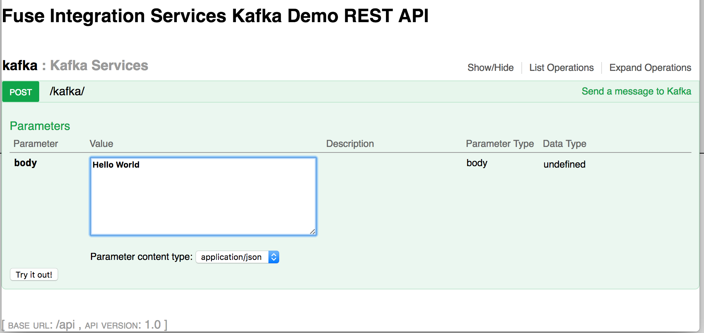
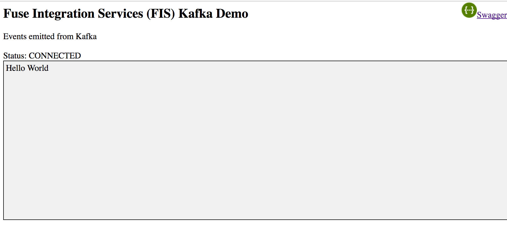

# FIS Kafka

Demonstration of an [Apache Kafka](https://kafka.apache.org/) based integration running on the OpenShift Container Platform

## Prerequisites

The following prerequisites must be met prior to progressing to subsequent sections:

* OpenShift Container Platform 3.3 environment available
* Six (6) availble [Persistent Volumes](https://docs.openshift.com/container-platform/latest/dev_guide/persistent_volumes.html)


## Build and Deployment to OpenShift

This section describes the steps necessary to build and deploy the various components of this demo to OpenShift. 

### OpenShift Environment

Create a new project called *fis-kafka* to house the components in this demo

```
oc new project fis-kafka --description="Fuse Integration Services Kafka Demo" --display-name="FIS Kafka"
```

### Kafka

This project showcases an integration with a containerized deployment of Kakfa. Kafka requires that [Apache Zookeeper](https://zookeeper.apache.org/) also be deployed and available as it serves as configuration management, coordination between distributed instances and a registry for Kafka.

Each component will deployed as a [PetSet (StatefulSet)](http://kubernetes.io/docs/concepts/abstractions/controllers/statefulsets/) since each is highly dependent on maintaining state. The steps to build and deploy Kafka are detailed within the Red Hat Community of  [here](https://github.com/redhat-cop/containers-quickstarts/tree/master/kafka)

**Important**: *Both Zookeeper and Kafka must be healthy and operational prior to building the sample application. The documentation referenced previously contains a section to validate the deployment.*

### Build and deploy the project

The sample application can be deployed using an OpenShift template or by using the building and deploying the project using the [Fabric8 Maven Plugin](https://fabric8.io/gitbook/mavenPlugin.html)

#### OpenShift Template

Insert some stuff here

### Manual build and deployment

Execute the following command within the project directory to invoke the *ocp* Maven profile that will the call the `clean fabric8:deploy` maven goal:

```
mvn -P ocp
```

The fabric8 maven plugin will perform the following actions:

* Compiles and packages the Java artifact
* Creates the OpenShift API objects
* Starts a Source to Image (S2I) binary build using the previously packaged artifact
* Deploys the application

### Running the Demo

The demonstration features a Spring Boot application that exposes both a restful and websocket endpoint. The restful service is decorated with a [Swagger UI](http://swagger.io/swagger-ui/) to describe the methods exposed. Once requests are consumed, they are sent to a Kafka topic. On the consuming end, messages are read off of the kafka topic and sent to the web services endpoint. 

A webpage is available to view messages that are received by the web socket endpoint

#### Executing a test message

Navigate to the webpage exposed by the application. This can be found by running the following command using the *oc* tool:

```
oc get route fis-kafka --template='{{ .spec.host }}'
```
	
Once the webpage load, the web socket connection will be established. All messages received from the kafka topic will be displayed in the box. 

The Swagger UI is available by clicking the link at the top right hand corner of the page. 

*Note: To fully visualize the demonstration, it is recommended the Swagger UI page be opened in a new tab or window*

Expand the available method in the swagger UI and in the textbox, enter a message and click **Try it out!**



The message will route through the integration and be displayed in the textbox on the main page of the application.


